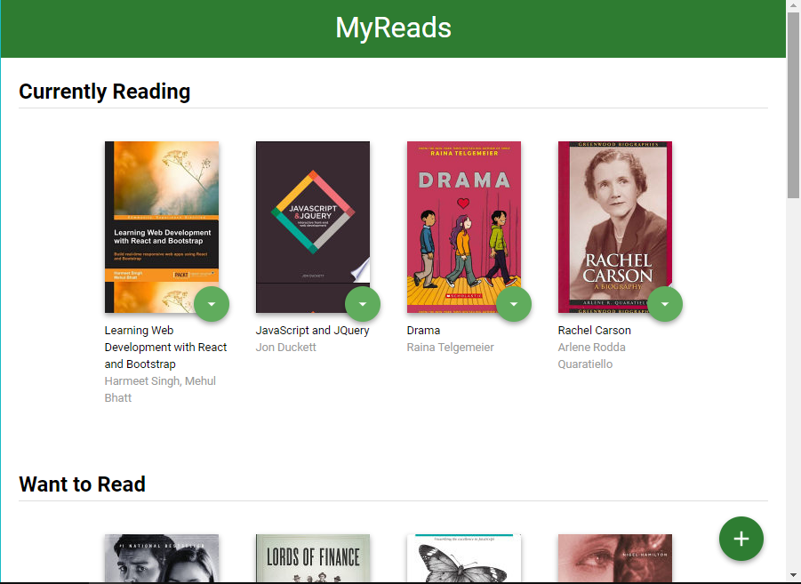

# MyReads Project

This is a simple project that organize user's books in categories/shelf like Currently Reading, want to read and Read. and the ability to search and switch between all categories/shelf



## Project Set Up and Installation

use npm:

```
npm install
```

or just use yarn:

```
yarn
```

## Documentation

To run the project use commands as follow:

| Command    | Description                     |
| ---------- | ------------------------------- |
| yarn start | start MyReads                   |
| yarn build | run live server for development |


## Searching

The backend API uses a fixed set of cached search results and is limited to a particular set of search terms, which can be found in [SEARCH_TERMS.md](SEARCH_TERMS.md). That list of terms are the _only_ terms that will work with the backend, so don't be surprised if your searches for Basket Weaving or Bubble Wrap don't come back with any results.
